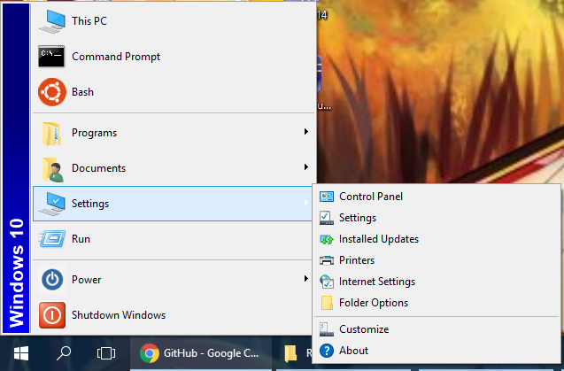
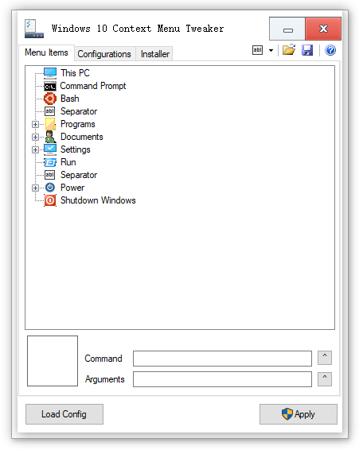

# Menu98

Menu98 brings back the familiar look of __classic Windows Start menu__, 
it __does NOT replace the start menu__, it enhances the context menu of the start button,
which is the one popup when you right-click the start button.

* The program replaces the start button context menu
* However on Windows 8 and above it does NOT replace Win+X menu
* To show the original context menu, right-click start while holding __Shift__

There is a graphical tool (Menuconfig.exe) designed to automate Menu98 installation and configuration:

## Installation
For most users, installing with Menuconfig.exe is the best choice, go to the release page to get it!

For advanced users, you need to download two dlls from
the release page (Menu98.dll contains x64 and x86 builds) and
the [Taskbar Context Menu Tweaker](https://github.com/rikka0w0/Taskbar-Context-Menu-Tweaker)'s release page.
Choose the right dll according to your system architecture. Place both `Menu98.dll` and `TaskbarContextMenuTweaker.dll` into
`%SystemRoot%\System32` (Same path for both x86 and x64 systems). Then run command `rundll32 TaskbarContextMenuTweaker.dll, Inject`.
For more details about the command, refer to readme of [Taskbar Context Menu Tweaker](https://github.com/rikka0w0/Taskbar-Context-Menu-Tweaker).
You may manually add the injection command into system start-up.

## System requirements
The program is designed for Windows 10. However it can also work on Windows 8.1, Windows 8, Windows 7, Windows XP and their server variants.

On Windows XP, .Net Framework 2.0 or 3.5 is a pre-request. No VC Runtime is required for any system (Thank to [VC-LTL](https://github.com/Chuyu-Team/VC-LTL)).

This program even works on Windows 98, but a lot of feature is not supported. 